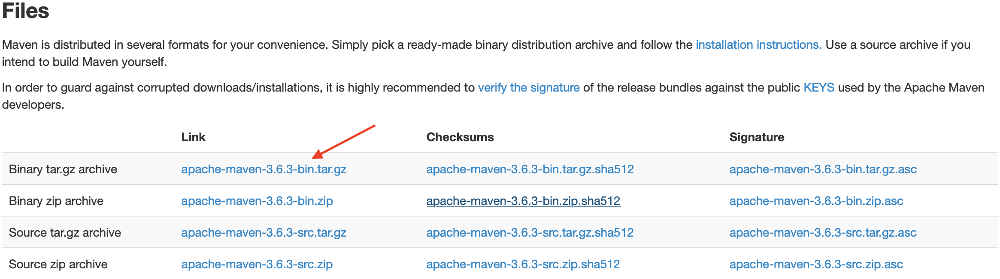
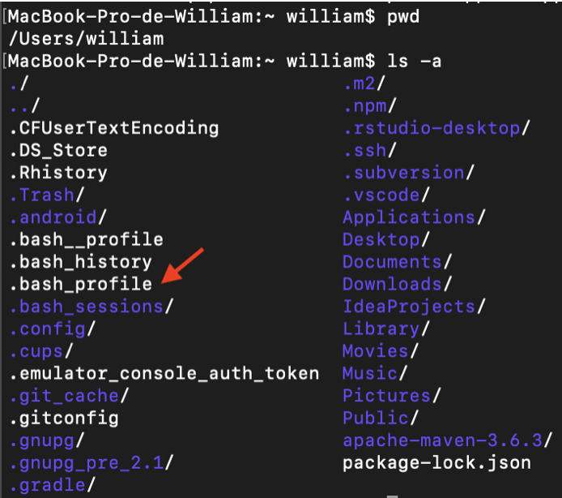
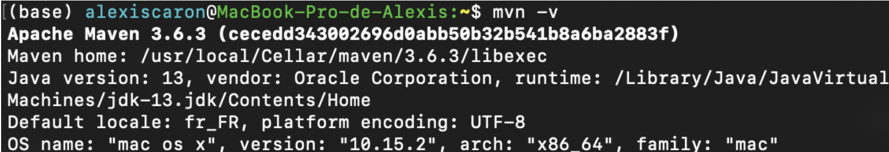
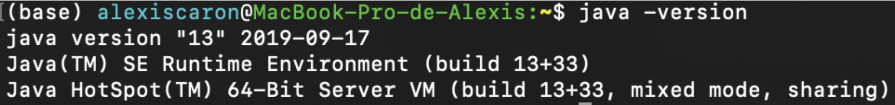

# Tutoriel d'installation de Maven pour MacOs

Installer Maven pour MacOs est simple. ce tutoriel donnes les étapes pour y arriver. 

## Étape 1 : Récupérer l'archive de Maven et la placer dans le bon répertoire.  
  * Se rendre sur le site https://maven.apache.org/download.cgi pour récupérer l’archive contenant Maven et prendre la version la plus récente (sauf contre-indication).
  
  * Une fois l’archive téléchargé, la décompresser la placer dans son dossier personnel (chemin Finder : MacintoshHD/Users/Nomutilisateur. Ouvrir un terminal, faire un PWD. Ce dernier doit retourner _/Users/Nomutilisateur_. Faire ls pour vérifier que le dossier se trouve bien dans le répertoire utilisateur).
  
## Étape 2 : Créer le fichier .bash_profile.
 * Avec la commande _ls -a_ , vérifier la présence d’un fichier .bash_profile . Si ce fichier n'existe pas, il sera créé par la suite.
 
 
 * Toujours dans le terminal, ouvrir le fichier .bash_profile en tapant la commande _nano ~/.bash_profile_ (cela fonctionne également avec vim par exemple). Si le fichier n’existe pas, nano le créera automatiquement, donc pas d’inquiétude.

## Étape 3 :Modifier le fichier .bash_profile.
* Dans le fichier _.bash_profile_, rajouter les deux lignes suivantes :
```bash
export M2__HOME=/Users/alexiscaron/apache-maven-3.6.3
export PATH=$PATH:$M2__HOME/bin
```

* Il faut adapter le chemin selon votre nom d’utilisateur, et votre version de maven, sinon cela ne fonctionnera pas correctement.
* Enregistrez et quittez.
* Fermez le Terminal de commande et relancez-le.

## Étape 4 : Vérifier que Maven est bien présent.
* Il ne reste plus qu'à vérifier la présence de Maven. Pour vous assurer que Maven a été correctement installé, entrez ensuite la commande suivante :

* Si Maven s’est installé correctement, le terminal devrait vous renvoyer un message avec votre numéro de version Apache Maven, ainsi que votre version de JDK java (indispensable pour faire fonctionner Maven correctement).


## FAQ :

**Q : J’ai suivi tout le tutoriel jusqu’au bout et mvn -v ne fonctionne pas ! une idée ?**

**A** : Bien sûr ! tout d’abord première chose, avez-vous installé le jdk ? si oui, quelle version avez-vous installé ? selon la version de Maven, il faudra une version du jdk un minimum récente pour que Maven puisse s’installer et fonctionner correctement.

Si vous n’avez pas installé le jdk, vous pouvez le faire ici :
https://www.oracle.com/technetwork/java/javase/downloads/index.html
Prenez le format .dmg, et MacOs s’occupera d’installer le jdk automatiquement dans le répertoire adéquat.
Ensuite, un simple java -version vous permettra de voir votre version de jdk, et d’être sûr que l’installation a été faite correctement.


Réessayez de faire un mvn -v. Cela devrait normalement fonctionner désormais. Si cela ne fonctionne toujours pas, cela pourrait être dû à votre chemin de définition des variables. Pour faire simple, vous avez pu vous tromper au moment de recopier les deux lignes qui vont dans le fichier .bash_profile. N’oubliez pas de remplacer le nom d’utilisateur par VOTRE nom d’utilisateur, sinon le chemin ne sera pas bon. De même, remplacez le chemin qui mène vers le dossier de maven selon son nom de version. Ne mettez pas apache-mavent-3.6.3 si vous avez la version 4 par exemple, cela n’aurait pas de sens.
